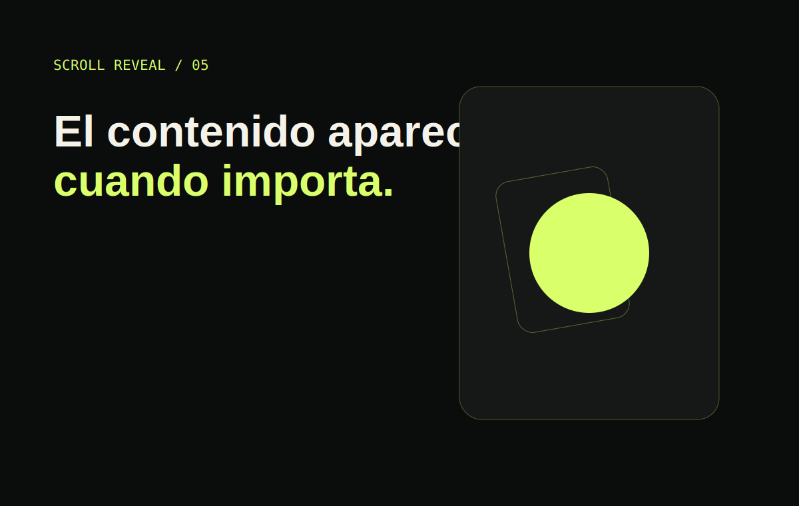

# Scroll Reveal Section

Escenario compacto con scroll interno, tres entradas progresivas y una composición lista para grabar.

## Características

- `IntersectionObserver` con el panel como raíz.
- Variantes de escala, dirección y profundidad.
- Reinicio de la secuencia desde el mismo bloque.
- Contenido visible sin JavaScript y con movimiento reducido.

## Demo en vivo

[scroll.ntdesweb.dev](https://scroll.ntdesweb.dev/)

## Instalación

Clona el repositorio, entra en `scroll-reveal-section` y abre `index.html`.

## Estructura del proyecto

`index.html` contiene la narrativa, `style.css` las variantes, `script.js` la observación y `assets/` las vistas previas.

## Cómo personalizarlo

Añade nuevas `.story-card`, define su dirección visual y actualiza el contenido de estado mediante atributos `data-*`.

## Accesibilidad

La clase inicial `no-js` evita ocultar contenido si falla JavaScript y movimiento reducido revela todo inmediatamente.

## Rendimiento

El observador se limita al panel interno y no requiere listeners globales de scroll.

## Licencia y créditos

[MIT](LICENSE). Creado por [Nacho Torres](https://github.com/NachoTorresRD) para [NTDESWEB](https://www.ntdesweb.com) con [NT-SKILL SUPREME](https://github.com/NachoTorresRD/nt-skill-supreme).

[Ver en GitHub](https://github.com/NachoTorresRD/scroll-reveal-section) · [Trabajar con NTDESWEB](https://www.ntdesweb.com)
